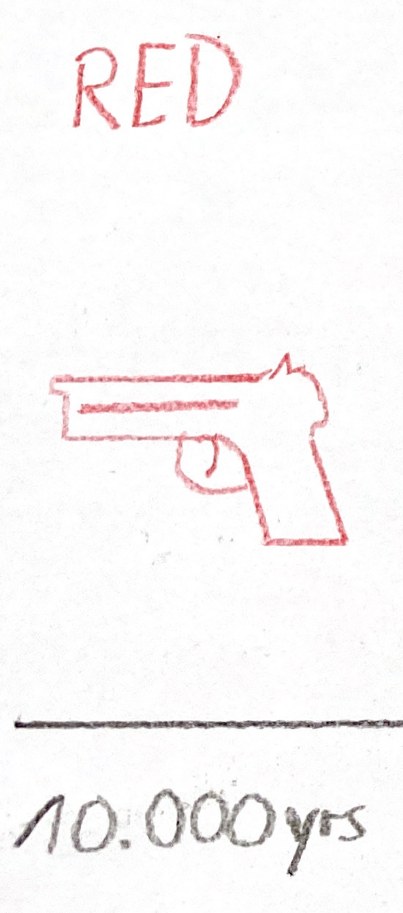
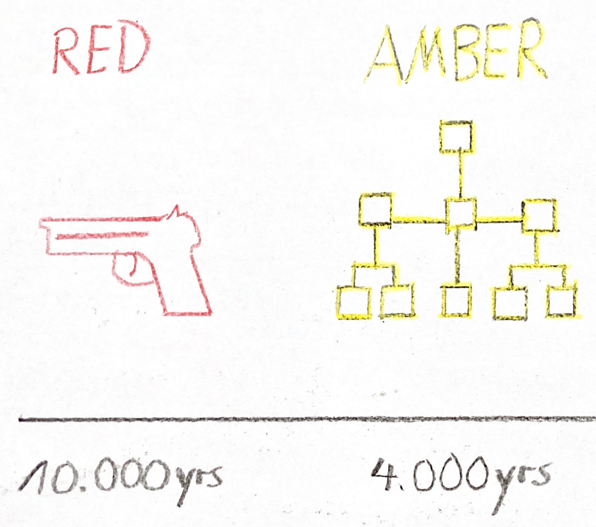
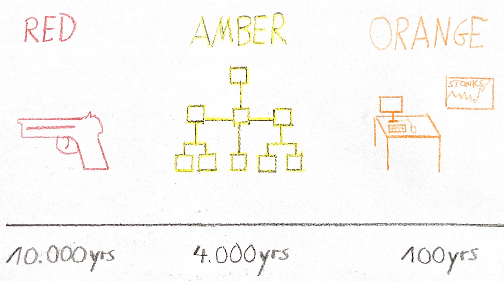

# Reinventing Organizations

Pascal Hornung

&

Mostafa Sayed

----

Agenda
-----

1. Introduction
1. Evolution of Human Consciousness

---

Introduction
-----
As humanity evolves, our old/existing models of organization may be inadequate for our new needs, aspirations and challenges.

**“Reinventing Organizations”** is the concepts and practices of a new generation of organizations that have made the leap to operate in a more soulful, purposeful, and productive way, thus allowing people to do productive and meaningful work, develop their talents/potential and fulfill their calling.

----

Evolution of Human Consciousness
-----
There is 7 key paradigms in the evolution of human consciousness and organizational models.

#### REACTIVE-INFRARED

#### MAGIC-MAGENTA

#### IMPULSIVE-RED
 
#### CONFORMIST-AMBER 

#### ACHIEVEMENT-ORANGE 

#### PLURALISTIC-GREEN 

#### EVOLUTIONARY-TEAL

---

REACTIVE-INFRARED AND MAGIC-MAGENTA PARADIGMS
-----
REACTIVE-INFRARED  | MAGIC-MAGENTA
:-------------------:| :------------------:
The earliest human beings were mainly foragers, living in small groups.|About 15,000 years ago, tribes grew larger and some command and authority emerged.

----

---

IMPULSIVE-RED PARADIGM
-----
The first real organizations emerged about 10,000 years ago. There was now a clear division of labor with command and authority, use of rewards and punishment to influence outcomes, but actions were still highly reactive and impulsive.  Red Organizations are like wolf packs.

**Examples:**
* ##### Mafia
* ##### Streetgangs
* ##### Tribal militias

----

---

CONFORMIST-AMBER PARADIGM
-----
About 4,000 years ago, there was a shift to agriculture, institutions and organized religion. People can now _**plan for the mid to long term** & **build stable, scalable organizational structures/processes**_. Amber Organizations operate like armies

**Examples:**
* ##### Catholic church
* ##### Most government agencies
* ##### Public school systems

----

---

ACHIEVEMENT-ORANGE PARADIGM
-----
This paradigm gave birth to many of our modern resource-allocation, appraisal and incentive systems.It’s built on the belief that individuals should be free to challenge the rules and do what’s the most effective to achieve success.Innovation is the key to staying ahead.Orange Organizations are dynamic and growth-oriented, but tend to operate like _soulless_ machines.
**Examples:**
* ##### Multinational companies
* ##### Charter schools

----

---
PLURALISTIC-GREEN PARADIGM
-----
Greens believe that life is more than just success or failure. They value relationships and ideals, e.g. fairness, equality, harmony, consensus.  They bring breakthroughs in the form of empowerment, values-driven cultures and multiple-stakeholder perspectives. Greens operate like families. They’re great for breaking down old structures, but may be less effective for delivering practical options and outcomes.

**Examples:**
* ##### Culture driven organizations (e.g. Southwest Airlines; Ben&Jerry‘s …)

----

EVOLUTIONARY-TEAL PARADIGM
-----
For centuries, mankind lived in the Infrared and Magenta paradigms. The concepts of “human resources” and “management” only surfaced in recent years. This means that we’re changing paradigms at an increasingly faster rate. We’re about to enter the next stage of human consciousness that corresponds with the “self-actualizing” level of Maslow’s hierarchy of needs.
**Examples:**
* ##### Patagonia
* ##### FAVI
* ##### Buurtzorg

----
